# MICROSERVICES

## Monolithic App VS Microservices App

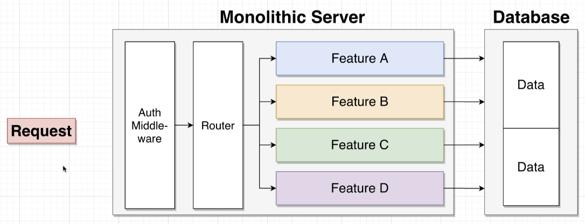
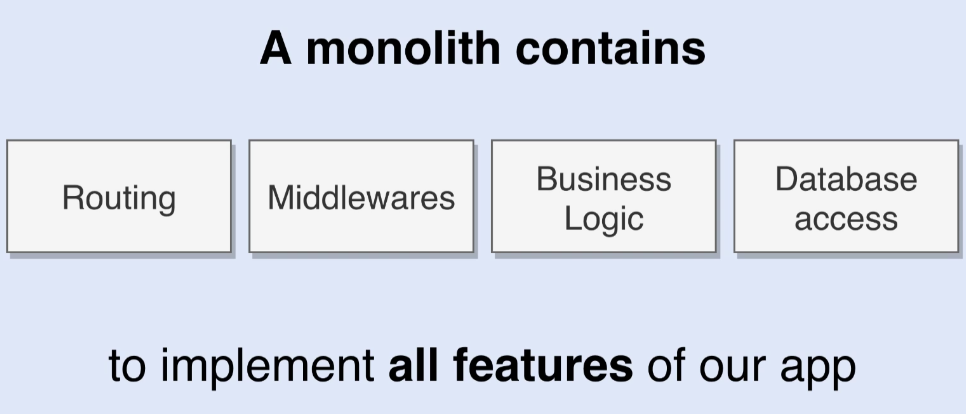

MICROSERVICES APP example

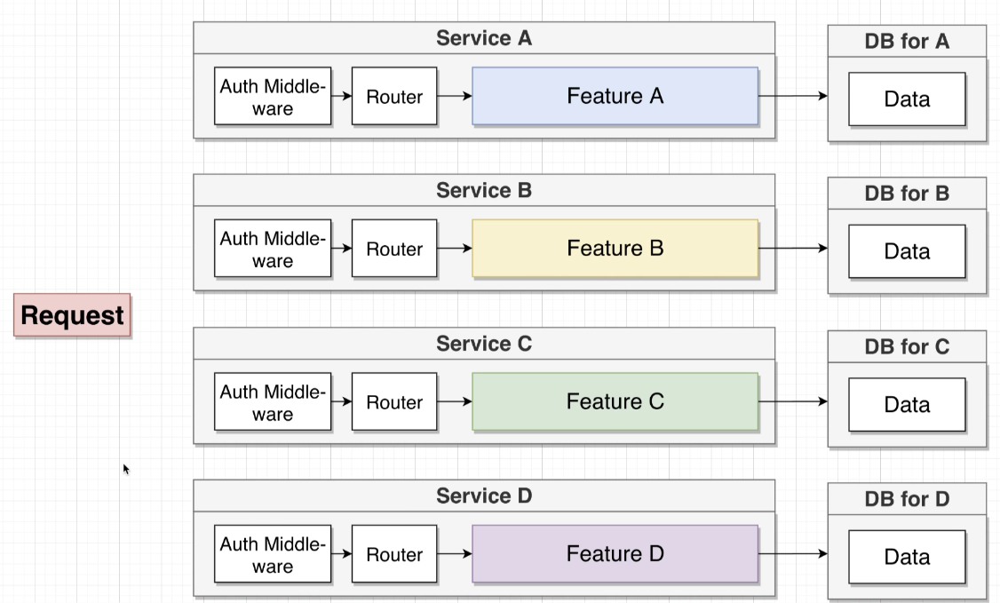
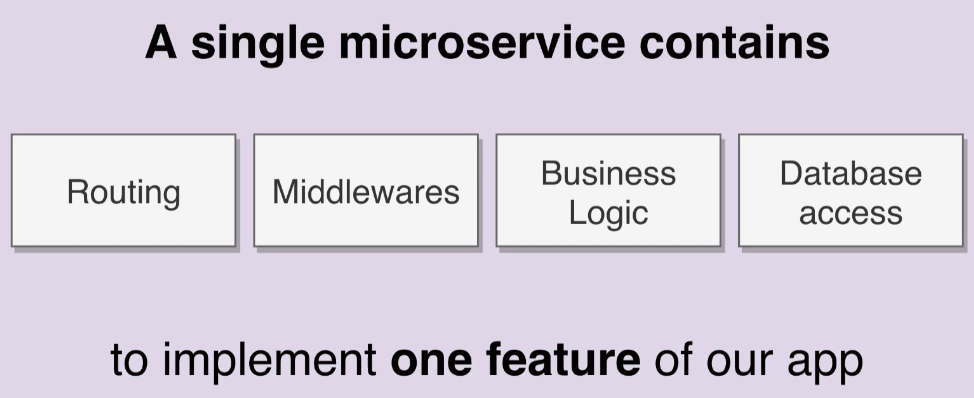

A big challenge with microserves app is data management between services

## Communication strategies between services

Definitions of `Sync` and `Async` in microserves have nothing to do with `async/await` in JavaScript

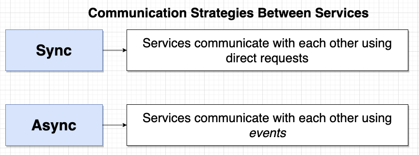

- ### Sync

  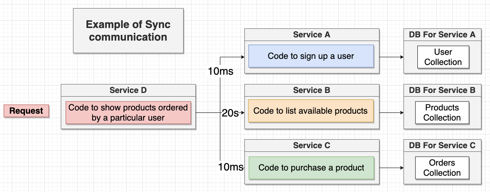
  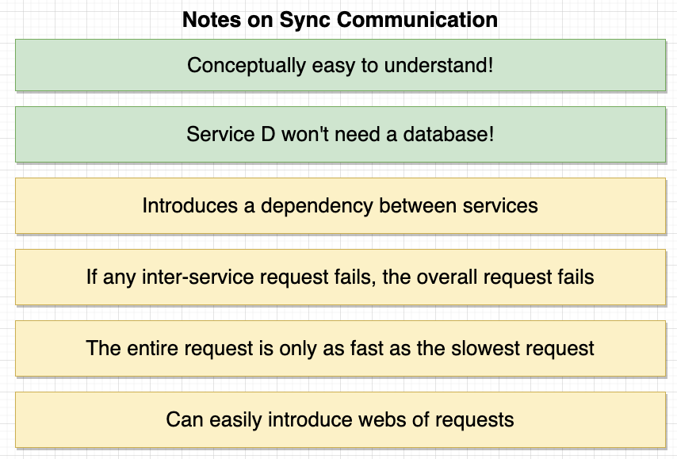

- ### Async

  - Async Strategy 1:

    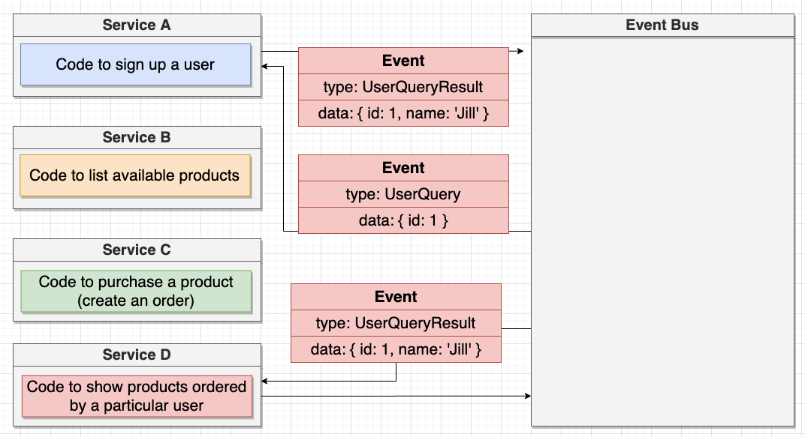

    This strategy has the same Pros and Cons as the Sync strategy

  - Async Strategy 2: (This is the one we'll use)

    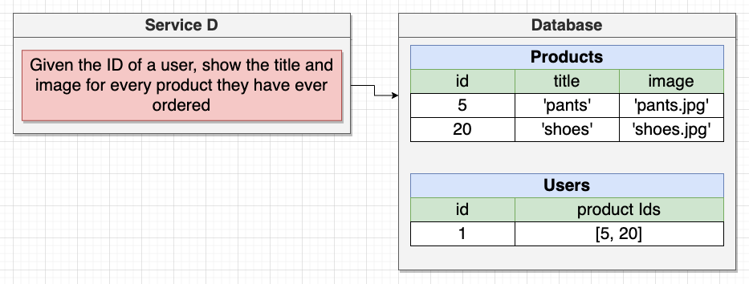
    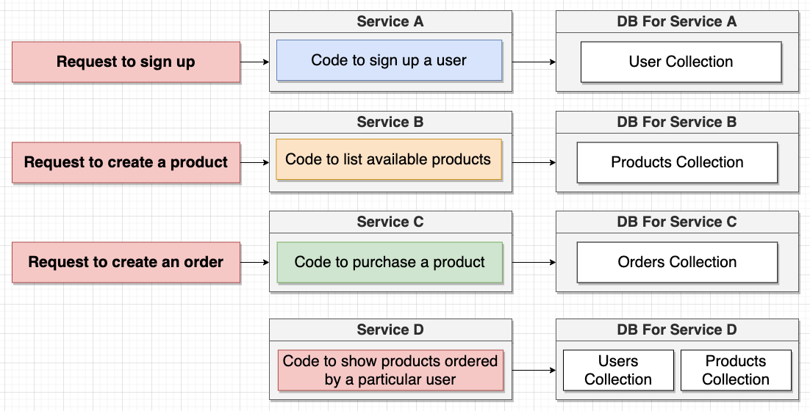
    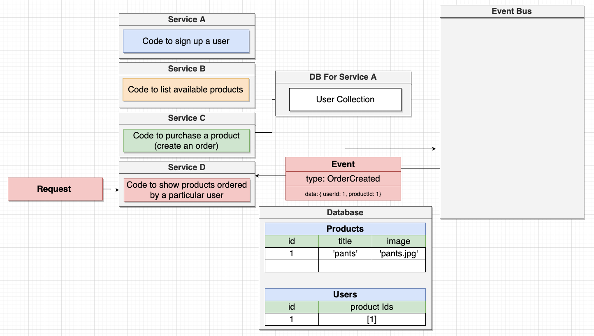
    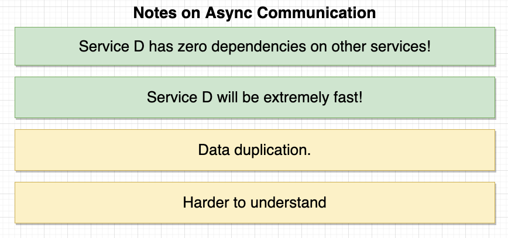
